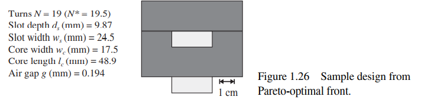

# LinkedinPublic — Power Electronics Engineering Notebooks

Jupyter notebooks and Python utilities for power electronics analysis, shared as companion material for [LinkedIn technical posts](https://www.linkedin.com/in/riccardotinivella/).

## Contents

### Notebooks

| Notebook | Topic | Description |
|:---------|:------|:------------|
| `20231122_emc.ipynb` | EMC | Conducted emission analysis and CISPR limit comparison |
| `20231124_inductor_nsga2.ipynb` | Magnetics | Multi-objective inductor optimization using NSGA-II (pymoo) |
| `20241124_efficiency.ipynb` | Converters | Power converter efficiency analysis and loss breakdown |

### Python Packages

| Package | Description |
|:--------|:------------|
| `efficiency/` | Converter efficiency calculation utilities |
| `emc/` | EMC limit definitions (CISPR 25, etc.) |
| `optim/` | Inductor optimization with Pareto front visualization |
| `pyZfit/` | Impedance fitting tool — fit LCR measurements to equivalent circuit models (GUI + CLI) |
| `pymkf/` | Interface to the Magnetics Knowledge Foundation (MKF) library |

### LinkedIn Analytics

| Path | Description |
|:-----|:------------|
| `linkedin_mngmt/` | Post performance metrics and content analytics |

## Highlights

### Inductor Optimization (NSGA-II)

Multi-objective optimization of UI-core inductors balancing volume, losses, and temperature rise:

<p align="center">
  
</p>

### Impedance Fitting (pyZfit)

GUI and CLI tool to fit measured impedance data (from LCR meters or impedance analyzers) to lumped-element equivalent circuit models:

- Multiple model topologies (R-L, R-L-C, Foster, Cauer networks)
- Curve fitting with parameter bounds
- Export to SPICE-compatible netlists

## Getting Started

```bash
# Clone
git clone https://github.com/tinix84/LinkedinPublic.git
cd LinkedinPublic

# Install dependencies
pip install numpy scipy matplotlib pandas pymoo jupyter

# Launch notebooks
jupyter notebook
```

## Dependencies

- Python 3.8+
- NumPy, SciPy, Matplotlib, pandas
- [pymoo](https://pymoo.org/) — multi-objective optimization
- Jupyter Notebook

## Author

[Riccardo Tinivella](https://github.com/tinix84) — Head of System Power Engineering @ BRUSA HyPower

## License

See individual files for license details.
